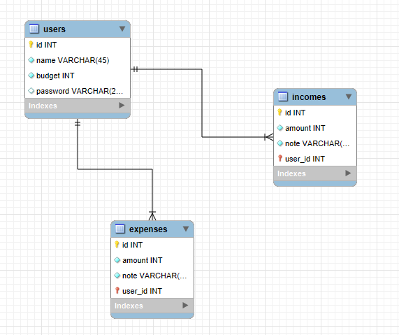

# Finanz Expense Tracker

This project is an Expense Tracker application built using vanilla HTML, CSS, and JavaScript on the frontend, with a MySQL database for data storage. The backend is powered by PHP, which handles the API for CRUD operations on expenses and incomes. This app allows users to track their income and expenses efficiently.

## Features

- **User Management**: Allows creating users with a specified budget.
- **Expense Tracking**: Users can add, update, delete, and view expenses with details like amount, note, and date.
- **Income Tracking**: Users can add, update, delete, and view incomes with details like amount, note, and date.
- **Sorting Functionality**: Sort expenses and income records by amount, note, and date.
- **CRUD Operations**: All operations (Create, Read, Update, Delete) for income and expenses are managed through PHP APIs.

## Project Structure

- **Frontend**: HTML, CSS, JavaScript
- **Backend**: PHP
- **Database**: MySQL
  - Tables:
    - `users`: Contains user information, such as ID, name, and budget.
    - `expenses`: Records each user's expenses, including amount, note, and date.
    - `incomes`: Records each user's income, including amount, note, and date.

## Database ERD

The following ERD (Entity-Relationship Diagram) shows the relationships between the tables used in the application:



- **users** table has a one-to-many relationship with **expenses** and **incomes** tables via `user_id`.

## API Endpoints

The backend exposes several endpoints to interact with the database.

- **Create Income**: `POST /apis/createIncome.php`
- **Retrieve Incomes**: `POST /apis/displayIncomes.php`
- **Update Income**: `POST /apis/updateIncome.php`
- **Delete Income**: `POST /apis/deleteIncome.php`

- **Create Expense**: `POST /apis/createExpense.php`
- **Retrieve Expenses**: `POST /apis/displayExpenses.php`
- **Update Expense**: `POST /apis/updateExpense.php`
- **Delete Expense**: `POST /apis/deleteExpense.php`

Each endpoint uses data in JSON format and expects parameters specific to each operation, such as user ID, amount, note, and date.

## Usage

1. Clone the repository and set up a local server (e.g., using XAMPP).
2. Import the database structure from the provided SQL file.
3. Configure the API endpoints by adjusting database connection settings in PHP files if needed.
4. Launch `index.html` in a browser to start using the app.

## Technology Stack

- **Frontend**: HTML, CSS, JavaScript
- **Backend**: PHP
- **Database**: MySQL

## Installation

1. Clone the repository.
   ```bash
   git clone <repository-url>
